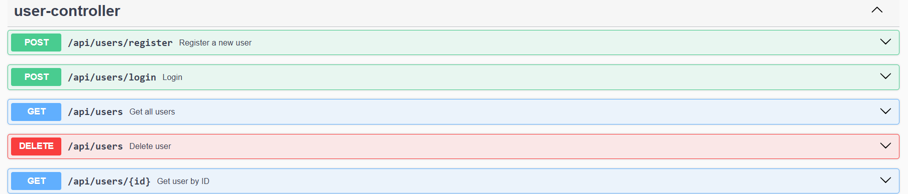
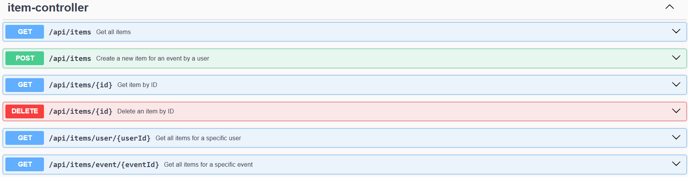
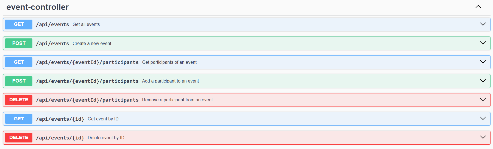
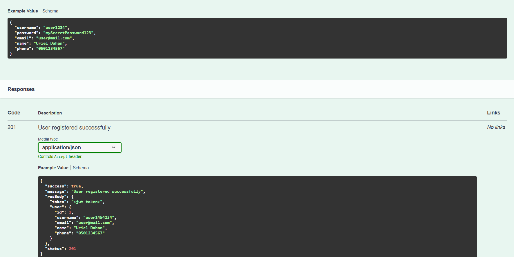
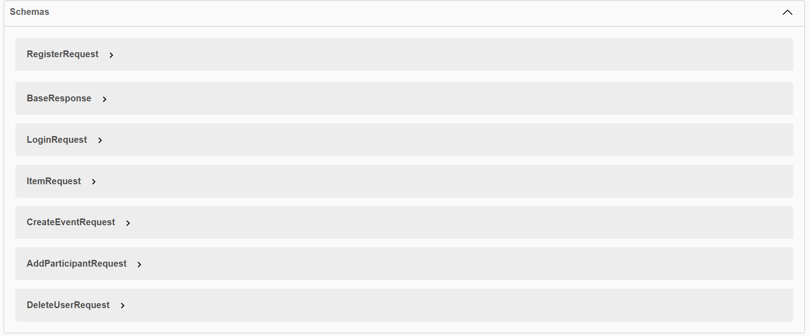
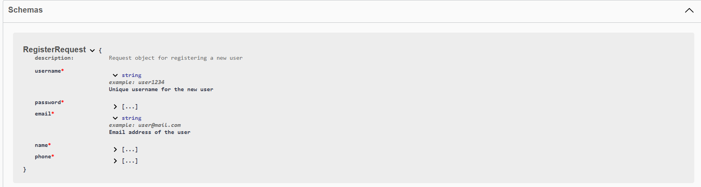
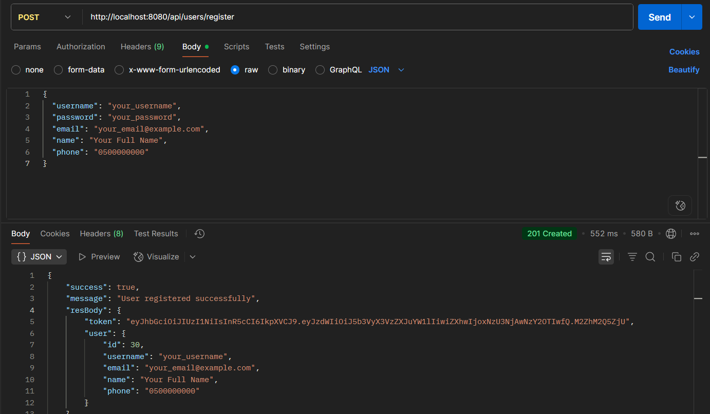
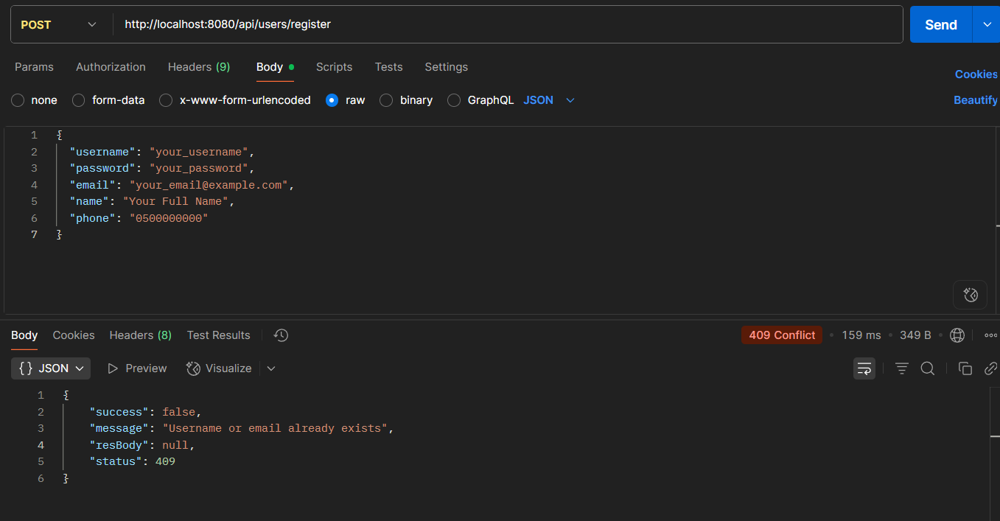
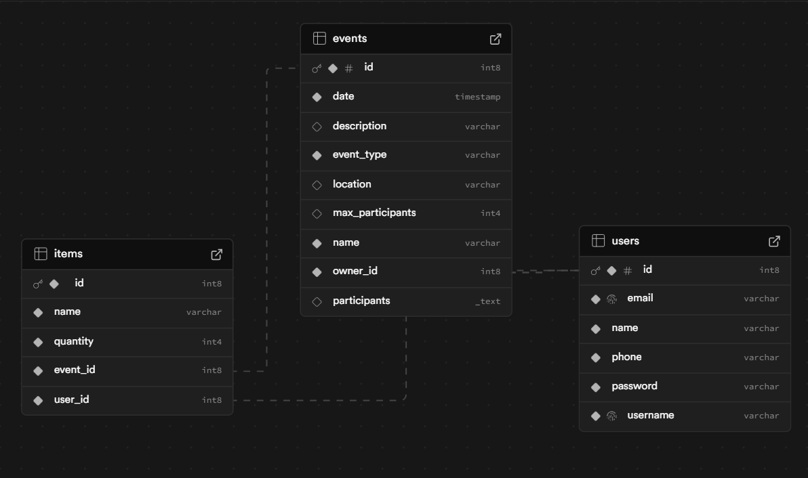
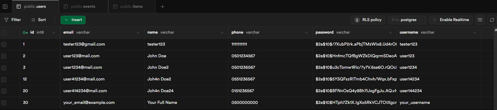

# 🎉 EventLife Backend

EventLife Backend is a **Spring Boot** service for managing events, users, and items that participants bring to those events.  
It provides a clean REST API with **JWT authentication** and full **Swagger documentation** for easy testing and integration.

---

## 👨‍💻 Authors

Project built by **Yarin Cohen** and **Uriel Dahan** in 2025.

📧 Contact us:
- [urielda00@gmail.com](mailto:urielda00@gmail.com)
- [yarin659@gmail.com](mailto:yarin659@gmail.com)


---

## 🚀 Features

- 🔐 **User Management** – Register, login, delete users, and fetch user profiles.
- 📅 **Event Management** – Create events, list all events, get event by ID, and delete events.
- 👥 **Participants** – Add or remove participants from events, view who’s attending.
- 🍕 **Items** – Manage items that participants bring to events (e.g., drinks, food, equipment).
- 🛡 **Security** – Passwords are hashed with **BCrypt**, authentication is handled via **JWT tokens**.
- 📜 **API Documentation** – Auto-generated via **Springdoc OpenAPI / Swagger UI** with example requests and responses.

---

## 🛠️ Tech Stack

- **Java 17**
- **Spring Boot 3** (Web, Data JPA, Security)
- **PostgreSQL 17** with **Flyway** migrations
- **Maven** – Dependency management & build
- **Springdoc OpenAPI** – Swagger UI integration
- **BCrypt** – Secure password hashing

---

## 📂 Project Structure

- **EventLifeProject/**
    - **src/main/java/com/example/eventlife/**
        - **model/** → JPA entities (`User`, `Event`, `Item`)
        - **repository/** → Spring Data JPA repositories
        - **service/** → Business logic (`UserService`, `EventService`, `ItemService`)
        - **rest/** → REST controllers + DTOs
        - **security/** → JWT & password hashing
    - **src/main/resources/**
        - `application.properties` → App configuration
    - **.idea/** → IntelliJ project settings
    - **.mvn/** → Maven wrapper support
    - **target/** → Build output (generated by Maven)
    - **pom.xml** → Maven configuration
    - **README.md** → Project documentation

---

## ⚙️ Setup & Installation

1. **Clone the repository**
   ```bash
   git clone https://github.com/EventLife123/EventLife.git
   ```

2. **Configure PostgreSQL** using environment variables. Copy `.env.example` as a
   reference and provide real values through your local environment or hosting
   platform. Never commit the resulting `.env` file.

   The default `dev` profile connects to `localhost:5432/eventlife` with
   development-only credentials. Flyway creates the schema and Hibernate validates
   it. Production should use the `prod` profile with
   `SPRING_JPA_HIBERNATE_DDL_AUTO=validate`.

3. **Build The Project**: 
```bash
  mvn clean install 
  ```

## Security configuration

EventLife uses stateless `Authorization: Bearer <token>` authentication. Tokens are
standard HS256 JWTs whose subject is resolved to an existing database user on every
authenticated request.

Production requires these environment variables:

- `APP_JWT_SECRET`: a random secret of at least 32 bytes. The application will not
  start without it outside the `dev` profile.
- `APP_JWT_EXPIRATION`: token lifetime in milliseconds (defaults to `600000`).
- `APP_CORS_ALLOWED_ORIGINS`: comma-separated exact frontend origins, for example
  `https://eventlife.example.com`. Wildcards are rejected.

The `dev` profile supplies a development-only JWT secret and permits
`http://localhost:5173` and `http://127.0.0.1:5173`. Credentials are disabled for
CORS because authentication uses bearer headers.

Public routes are registration, login, Swagger/OpenAPI, event reads, and event-item
reads. Other routes require a valid JWT. Event creation/deletion, join/leave, item
creation/deletion, and user-specific reads enforce the authenticated identity.

For frontend compatibility, the request fields `CreateEventRequest.ownerId`,
`CreateEventRequest.participants`, `AddParticipantRequest.username`,
`ItemRequest.userId`, and `DeleteUserRequest.username` are still accepted but are
ignored by the backend. Identity always comes from the verified JWT.

📸 **Swagger Screenshots**
## 📌 Users routes


## 📌 Items routes


## 📌 Events routes


## 📌 req/res Template


## 📌 Schemas


## 📌 Schemas sample



## 📬 Postman – Example 1 : register


## 📬 Postman – Example 2 : validation


## 🗄 Database – Overall


## 🗄 Database – Users table (for example)



© 2025 Yarin Cohen & Uriel Dahan.  
All rights reserved.
